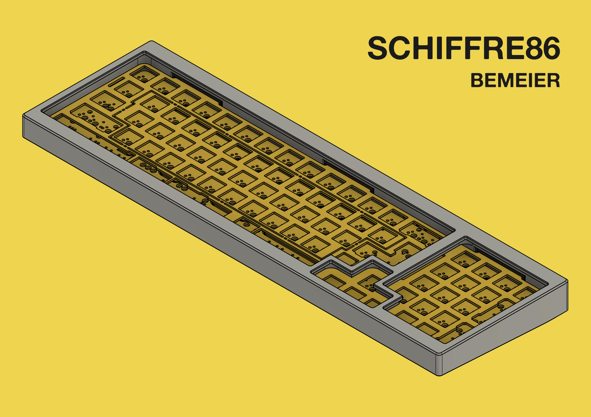
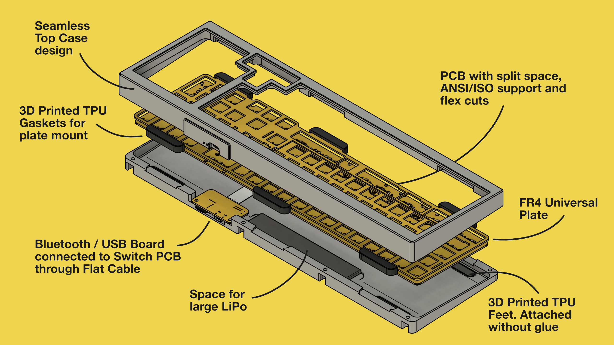
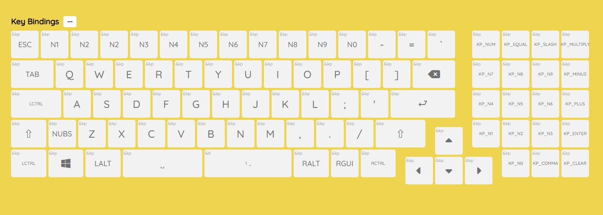

# SCHIFFRE

The Schiffre project is a mechanical keyboard featuring a host board and shield design, using a Flexible Flat Cable (FFC) as interconnect.
All PCBs designed with Kicad 7.0. Case designed in Fusion.

## COMPONENTS
In this repository you will find everything to build a Schiffre 86 board.

- The host board: `schiffre_nrf`
- The shield PCB: `schiffre_86_pcb`
- The switch plate: `schiffre_86_plate`, with files for production from FR4.
- The case: `schiffre_86_case`, designed with both 3D printing and CNC machining in mind.

In addition there is a breakout board for the 30 pin FFC connector, with a RPi Pico header in `schiffre_pico`.

## BOM
See the production subfolders in the respective folders for the smd/assembly components.
Some additional components need to be ordered seperately.

**For the NRF host board (`schiffre_nrf`):**
 - One E73-2G4M08S1C bluetooth module [AliExpress](https://aliexpress.com/item/32944356249.html)
 - One 100mm reversible FFC calbe with 30 pins and .5mm pitch [AliExpress](https://aliexpress.com/item/1005002259855390.html) to connect between the host and shield pcb (`schiffre_86_pcb`).
 - A LiPo rechargable battery. There is room for a long, but narrow and thin one.
   - Thickness <= 4mm, and width <= 25mm. 
   - Make sure to only use LiPos with battery protection ICs included (usually the case).
   - 4x20x60mm 600mAh [AliExpress](https://aliexpress.com/item/1005005086965061.html)
   - 4x25x100mm 1200mAh [AliExpress](https://aliexpress.com/item/1005005067026996.html)

**For the Case (`schiffre_86_case`):**
 - M3x5.7x4.6 and M2x4x3.6 Heat-set inserts (if 3D printing the case or machining from plastics) [AliExpress](https://www.aliexpress.com/item/4001258499799.html).
 - DIN912 socket head screws: 8x M3x10mm, 4x M2x6mm [AliExpress](https://www.aliexpress.com/item/32810872544.html)
 - Plate mounting gaskets and case feet need to be 3D printed from TPU.

## First Prototype
TODO

## FIRMWARE
ZMK support works. See the [schiffre branch on our fork](https://github.com/Bemeier/zmk/tree/schiffre). 
There is a [zmk-config template for the schiffre86](https://github.com/Bemeier/schiffre86-zmk-config) that you can clone to build your own keymap.
It comes with support for nickcoutsos' [keymap-editor](https://nickcoutsos.github.io/keymap-editor/).

For a precompiled version see `schiffre86-schiffre_nrf-zmk.uf2` in the `firmware` folder.

## PROJECT NAME
*Schiffre* is a combination of the german word *Chiffre* (translation of Cypher, the board this project was based on originally), and the word *Schiff*, which means ship or big boat, reflecting the shape of the keyboard.

## TODO
 - Couldn't get the XTAL to work yet
 - Add some decoupling caps..
 - Add a Battery switch
 - Test the external power for backlight / LEDs.
 - Revisit the FCC pinout, especially with other aux devices that may be on the shield board (i.e. encoders or OLEDs)
 - Make FCC "reversible" i.e. mirror power pins.